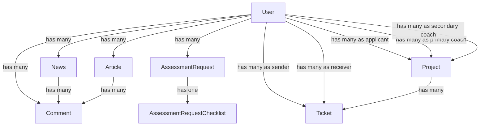

# Code Wiki

## 1. Project Overview

This repository is a Laravel 9 monolith for the ASA Center website and internal dashboard.

At a high level, the application combines:

- A public-facing website with static informational pages
- A content system for news and articles
- A role-based dashboard for administrators and staff
- An assessment request intake workflow
- A project tracking workflow with staged reports and private files
- A ticketing system for support and project communication

The application is primarily server-rendered using Blade templates. Frontend assets are a mix of:

- Checked-in static CSS/JS under `public/`
- Laravel/Vite scaffolding under `resources/`, although the main layout currently comments out `@vite(...)`

## 2. Technology Stack

### Backend

- PHP `^8.0.2`
- Laravel `^9.19`
- Eloquent ORM
- Blade templating
- MySQL as the default configured database

### Main PHP Packages

- `spatie/laravel-permission`
  - Role and permission management
- `mews/captcha`
  - CAPTCHA validation during registration
- `morilog/jalali`
  - Jalali date formatting for Persian UI
- `rap2hpoutre/laravel-log-viewer`
  - In-dashboard log viewing
- `laravel/sanctum`
  - Minimal API auth capability, currently only default `/api/user`
- `spatie/laravel-sitemap`
  - Sitemap generation support, currently commented out in routes

### Frontend

- Blade templates
- Bootstrap 5
- Alpine.js
- Vite tooling present
- Sass support present

## 3. Repository Structure

```text
Project/
├─ app/
│  ├─ Http/
│  │  ├─ Controllers/     # Feature logic and request handling
│  │  ├─ Middleware/      # Request guards and session limiting
│  │  └─ Requests/        # Limited form request classes
│  ├─ Models/             # Eloquent domain models
│  └─ Providers/          # Route and app bootstrapping
├─ bootstrap/             # Laravel bootstrap
├─ config/                # Framework and app configuration
├─ database/
│  ├─ factories/          # Model factories
│  ├─ migrations/         # Schema evolution
│  └─ seeders/            # Roles/permissions bootstrap
├─ public/                # Web root, compiled/static assets, uploaded files
├─ resources/
│  ├─ js/                 # Vite JS entrypoints
│  ├─ sass/               # Vite Sass entrypoints
│  ├─ lang/               # English/Persian translations
│  └─ views/              # Blade templates
├─ routes/                # Web and API route definitions
├─ storage/               # Logs, sessions, private/public files
├─ tests/                 # PHPUnit feature/unit tests
├─ artisan                # Laravel CLI entrypoint
├─ composer.json          # PHP dependencies
├─ package.json           # Node dependencies
└─ vite.config.js         # Frontend build config
```

## 4. High-Level Architecture

The application follows a classic Laravel MVC flow:

1. HTTP requests enter via `public/index.php`
2. Laravel bootstraps through `bootstrap/app.php`
3. `app/Providers/RouteServiceProvider.php` loads `routes/web.php` and `routes/api.php`
4. Route middleware applies request guards, sessions, CSRF, auth, and permissions
5. Controllers execute request-specific business logic
6. Controllers read and write through Eloquent models
7. Blade views render HTML responses

### Architecture Style

- Monolithic Laravel application
- Controller-heavy business logic
- Thin or nonexistent service layer
- Eloquent models define the main data relationships
- Blade is the primary presentation layer

### Request Segmentation

- Public routes:
  - Informational pages
  - News/article listing and detail pages
- Authenticated dashboard routes:
  - Profile management
  - User and role administration
  - Projects and assessment requests
  - News, articles, comments, sliders
  - Tickets and support tickets

## 5. Bootstrap and Runtime Flow

### Main Entrypoints

- `public/index.php`
  - Web entrypoint for Apache/Nginx/WAMP
- `artisan`
  - CLI entrypoint for Laravel commands
- `routes/web.php`
  - Main application routing
- `routes/api.php`
  - Minimal API routing

### Route Registration

`app/Providers/RouteServiceProvider.php` sets:

- `web` middleware for `routes/web.php`
- `api` middleware with `/api` prefix for `routes/api.php`
- Post-login home path as `/dashboard`

### Middleware Pipeline

`app/Http/Kernel.php` defines:

- Global middleware:
  - Proxies, CORS, maintenance, request normalization
- `web` middleware group:
  - Cookies
  - Session startup
  - CSRF protection
  - Route model binding
  - Custom `LimitUserSessions`
- Route middleware:
  - `auth`, `guest`, `can`, `signed`, `verified`
  - custom `access.to.website`

## 6. Routing Map

### Public Site

Defined in `routes/web.php` under `Route::middleware('access.to.website')`.

Main public endpoints:

- `/`
  - Home page via `HomeController@index`
- Static content pages:
  - `/vision-and-goal`
  - `/activities`
  - `/work-organization`
  - `/policies-and-guidelines`
  - `/executive-regulations`
  - `/about-us`
- News:
  - `/news`
  - `/news/{news}`
  - `/news/{news}/comment`
- Articles:
  - `/articles`
  - `/articles/{article}`
  - `/articles/{article}/comment`

### Dashboard

All dashboard routes are nested under:

- Prefix: `dashboard`
- Name prefix: `dashboard.`
- Middleware: `auth`

Sub-areas include:

- `my-profile`
- `manage-users`
- `manage-roles`
- `manage-projects`
- `manage-projects/manage-requests`
- `manage-news`
- `manage-articles`
- `manage-sliders`
- `manage-comments`
- `manage-tickets`
- `manage-support-tickets`
- `requests`
- `my-projects`
- `my-tickets`
- `submit-news`
- `my-articles`

### Authorization Pattern

Administrative route groups rely heavily on `can:` middleware from Spatie permissions:

- `can:manage_users`
- `can:manage_roles`
- `can:manage_projects`
- `can:manage_news`
- `can:manage_articles`
- `can:manage_sliders`
- `can:manage_comments`
- `can:manage_tickets`
- `can:manage_support_tickets`
- `can:manage_logs`
- `can:submit_news`
- `can:submit_article`

### Authentication Routing

There are two auth sources in play:

- `Auth::routes()`
  - Traditional Laravel UI auth routes
- Custom registration extensions in `routes/web.php`
  - Mobile-number verification flow
  - CAPTCHA-protected registration pre-validation

`routes/auth.php` also exists with newer auth-style route definitions, but `RouteServiceProvider` only loads `web.php` and `api.php`. In practice, `web.php` is the active source.

## 7. Frontend and View Layer

### Main Layouts

- `resources/views/master.blade.php`
  - Base public layout
  - Navbar, footer, static asset loading
  - RTL and Persian-first UI
- `resources/views/layouts/app.blade.php`
  - Wraps content inside `master`
  - Contains commented-out `@vite(...)`

### Rendering Strategy

The project mainly uses:

- Blade views
- Static CSS files from `public/css`
- Bootstrap assets from `public/bootstrap-5.3.3`

Although Vite is configured, the active layout is currently wired more strongly to checked-in public assets than to a live Vite workflow.

### Localization

- Default locale: `fa`
- Fallback locale: `en`
- Translation files exist under `resources/lang/en` and `resources/lang/fa`
- Jalali date formatting appears in models and controllers for Persian display

## 8. Major Functional Modules

### 8.1 Public Website

Purpose:

- Expose informational pages
- Show home slider
- Publish news and articles
- Accept authenticated comments

Key files:

- `app/Http/Controllers/HomeController.php`
- `app/Http/Controllers/NewsController.php`
- `app/Http/Controllers/ArticleController.php`
- `app/Http/Controllers/CommentController.php`
- `resources/views/home.blade.php`
- `resources/views/news/*`
- `resources/views/articles/*`
- `resources/views/master.blade.php`

### 8.2 User and Role Administration

Purpose:

- Manage users and assigned roles
- Manage role definitions and permissions
- Preserve minimum admin presence

Key files:

- `app/Http/Controllers/UserController.php`
- `app/Http/Controllers/RoleController.php`
- `database/seeders/RolePermissionSeeder.php`

### 8.3 Content Management

Purpose:

- Author and moderate news
- Author and moderate articles
- Moderate comments
- Upload rich-text images via Summernote

Key files:

- `app/Http/Controllers/NewsController.php`
- `app/Http/Controllers/ArticleController.php`
- `app/Http/Controllers/CommentController.php`
- `app/Http/Controllers/SummernoteController.php`

### 8.4 Assessment Request Workflow

Purpose:

- Let authenticated users submit product assessment requests
- Collect a follow-up checklist
- Let project managers review and download request data

Key files:

- `app/Http/Controllers/UserRequestController.php`
- `app/Models/AssessmentRequest.php`
- `app/Models/AssessmentRequestChecklist.php`
- `resources/views/dashboard/requests/*`
- `resources/views/dashboard/manage-projects/manage-requests/*`

### 8.5 Project Management

Purpose:

- Create projects from applicants and optionally assessment requests
- Assign primary and secondary coaches
- Track stage-based lifecycle and uploaded report files
- Expose separate views for managers and project participants

Key files:

- `app/Http/Controllers/ProjectController.php`
- `app/Models/Project.php`
- `resources/views/dashboard/manage-projects/*`
- `resources/views/dashboard/my-projects/*`

### 8.6 Ticketing

Purpose:

- General ticket administration
- Support ticket exchange
- Project-specific ticket conversations

Key files:

- `app/Http/Controllers/TicketController.php`
- `app/Models/Ticket.php`
- `resources/views/dashboard/manage-tickets.blade.php`
- `resources/views/dashboard/manage-support-tickets.blade.php`
- `resources/views/dashboard/my-tickets.blade.php`
- `resources/views/dashboard/my-projects/tickets.blade.php`

### 8.7 Profile and Account Management

Purpose:

- Update user display name
- Change password
- Manage avatar
- Self-delete account with admin-count protection

Key files:

- `app/Http/Controllers/ProfileController.php`
- `app/Models/User.php`

### 8.8 Home Slider Management

Purpose:

- Control carousel slides used on the home page

Key files:

- `app/Http/Controllers/SliderController.php`
- `app/Models/Slider.php`

## 9. Key Controllers and Responsibilities

### `HomeController`

- `index()`
  - Loads sliders ordered by `slide_number`
  - Renders the home page

### `NewsController`

- `allApprovedNews()`
  - Lists approved, non-archived news
- `show($id)`
  - Loads one approved news item with comment authors
- `manageNews(Request $request)`
  - Admin filtering and pagination
- `updateStatus()`
  - Sets `pending`, `approved`, or `rejected`
- `updateIsArchived()`
  - Archives/unarchives news
- `store()`
  - Creates news and uploads cover/slider images to `storage/app/public/news`
- `update()`
  - Replaces/removes files and updates content
- `destroy()`
  - Deletes database record and associated media

### `ArticleController`

- `allApprovedArticles()`
  - Lists approved articles
- `show($id)`
  - Loads one approved article with comment authors
- `manageArticles(Request $request)`
  - Admin filtering and pagination
- `updateStatus()`
  - Moderation status control
- `myArticles()`
  - Lists current user’s articles
- `store()`
  - Creates article with optional image and attachment
- `edit($id)`
  - Enforces ownership before editing
- `update()`
  - Updates files/content and resets status to `pending`
- `destroyOwnArticle($id)`
  - Allows owners to delete their own articles

### `CommentController`

- `storeForNews()`
  - Creates a pending comment for a news item
- `storeForArticle()`
  - Creates a pending comment for an article
- `manageComments()`
  - Admin filtering and pagination
- `updateStatus()`
  - Approves/rejects comments
- `destroy()`
  - Removes comments

### `ProjectController`

- `manageProjects()`
  - Filters and paginates project records
- `projectReports($id)`
  - Admin report view for a project
- `create()`
  - Loads users in `admin` or `coach` roles as assignable coaches
- `store()`
  - Creates project
  - Validates stage fields
  - Ensures uploaded filenames are unique within the request
  - Stores stage files under `storage/app/private/project_files/{project_id}`
- `update()`
  - Handles stage edits and optional file replacement/removal
  - Rejects newly uploaded filenames if the same file already exists for that project
- `downloadFile()`
  - Admin download of private project files
- `myProjects()`
  - Builds applicant and coach project lists for the current user
- `myProjectReports()`
  - Participant-facing project report view with access check
- `downloadMyProjectFile()`
  - Participant-facing private download with access check
- `myProjectTickets()`
  - Participant-facing ticket view for a project

### `UserRequestController`

- `index()`
  - Dashboard landing page for requests
- `assessment()`
  - Prepares display values for the assessment form, including Persian numbering
- `storeAssessmentRequest()`
  - Validates request metadata
  - Stores optional archive file in `storage/app/private/assessment_request_files`
  - Redirects to checklist step
- `assessmentChecklist($id)`
  - Prevents duplicate checklist submission
  - Restricts access to the owner
- `storeAssessmentChecklist()`
  - Saves boolean checklist answers
- `manageRequests()`
  - Admin filtering and pagination for incoming requests
- `showRequest($id)`
  - Displays request + checklist with Jalali date formatting
- `downloadRequestFile($file)`
  - Admin download for private request files
- `destroyRequest($id)`
  - Deletes request and stored attachment

### `TicketController`

- `manageTickets()`
  - Admin filtering across all tickets
- `manageSupportTickets()`
  - Filters only non-project tickets
- `storeSupportTicket()`
  - Sends a support ticket to a selected receiver
- `storeProjectTicket()`
  - Creates a ticket linked to a project
- `store()`
  - Creates a general non-project ticket for the current user
- `updateStatus()`, `updateSupportTicketStatus()`, `updateProjectTicketStatus()`
  - Workflow status changes
- `updateResponse()`, `updateSupportTicketResponse()`, `updateProjectTicketResponse()`, `updateMyTicketResponse()`
  - Write responder text with varying access rules
- `myTickets()`
  - Lists current user’s non-project tickets

### `ProfileController`

- `updateName()`
  - Updates display name
- `updatePassword()`
  - Requires current password and enforces uppercase/min length rule
- `updateAvatar()`
  - Replaces stored avatar in `storage/app/public/avatars`
- `deleteAvatar()`
  - Removes current avatar
- `deleteAccount()`
  - Removes current user after guarding against too-few admins

### `UserController`

- `manageUsers()`
  - Filters by id, name, email, and role
- `updateRole()`
  - Changes role with protection against dropping below two admins
- `destroy()`
  - Deletes another user and their avatar, with admin-count safeguard

### `RoleController`

- `manageRoles()`
  - Loads roles, permissions, and current role-permission mapping
- `store()`
  - Creates a role and syncs permissions
- `update()`
  - Renames role and re-syncs permissions
- `destroy()`
  - Reassigns affected users to `user` before deleting the role

### `SliderController`

- `manageSliders()`
  - Displays current slides
- `store()`
  - Creates a slide and stores image in `storage/app/public/sliders`
- `update()`
  - Updates metadata and optionally replaces image
- `destroy()`
  - Deletes slide and its file

### `Auth\RegisterController`

This controller customizes the registration flow beyond Laravel defaults:

- `validateRegisterData()`
  - Validates name, email, mobile number, password, and CAPTCHA
  - Stores pending registration data in session
- `sendVerificationCode()` / `resendVerificationCode()`
  - Wrap SMS delivery logic
- `sendViaSms()`
  - Generates a 6-digit verification code
  - Stores it in session
  - Currently flashes the code instead of calling a real SMS provider
- `verifyCode()`
  - Enforces expiration and attempt limits
  - Creates the user after successful verification
  - Assigns the `user` role

## 10. Core Domain Models

### `User`

Traits:

- `HasApiTokens`
- `HasFactory`
- `Notifiable`
- `HasRoles`
- `SoftDeletes`

Primary relationships:

- `news()`
- `articles()`
- `comments()`
- `assessmentRequest()`
- `projectsAsApplicant()`
- `projectsAsPrimaryCoach()`
- `projectsAsSecondaryCoach()`
- `ticketsAsSender()`
- `ticketsAsReceiver()`

### `News`

- Soft-deletable content entity
- Stores:
  - `title`
  - `content`
  - `image`
  - `slider_images` as array
  - `user_id`
- Relationships:
  - `user()`
  - `comments()`
  - `approvedComments()`
  - `categories()`
- Utility:
  - `getCreatedAt()` returns Jalali-formatted Persian date

### `Article`

- Soft-deletable content entity
- Stores:
  - `type`
  - `title`
  - `content`
  - `user_id`
- Relationships:
  - `user()`
  - `comments()`
  - `approvedComments()`
  - `topics()`
- Utility:
  - `getCreatedAt()` returns Jalali-formatted Persian date

### `Comment`

- Soft-deletable moderation entity
- Belongs to:
  - a `user`
  - either a `news` item or an `article`

### `AssessmentRequest`

- Soft-deletable intake entity
- Stores applicant, manager, and product metadata
- Stores optional uploaded request archive
- Relationships:
  - `user()`
  - `checklist()`
- Utility:
  - `getCreatedAt()` returns Jalali-formatted date-time

### `AssessmentRequestChecklist`

- Soft-deletable checklist entity
- One-to-one child of an assessment request
- Stores many boolean readiness/documentation fields

### `Project`

- Soft-deletable project lifecycle entity
- Connects:
  - applicant user
  - primary coach
  - optional secondary coach
  - optional assessment request
- Holds stage notes and associated filenames for project phases
- Relationship:
  - `tickets()`

### `Ticket`

- Soft-deletable conversation entity
- May be:
  - general
  - support
  - project-specific
- Relationships:
  - `sender()`
  - `receiver()`
  - `project()`
- Utility:
  - `getCreatedAt()` returns Jalali-formatted date-time

### `Slider`

- Stores home-page slide metadata and image filename

### Secondary / Incomplete Models

The repository also contains:

- `Category`
- `Topic`
- `Standard`
- `Certificate`
- `Achievement`

These appear to represent future or partially integrated taxonomy/certification features. Current controller and route usage is minimal or absent.

## 11. Data Relationships

### Main Relationships



### Taxonomy-Related Relationships

The codebase shows mixed intent for categorization:

- migrations create pivot tables:
  - `category_news`
  - `article_topic`
- `Category` and `Topic` use `belongsToMany(...)`
- but `News::categories()` and `Article::topics()` currently use `hasMany(...)`

This suggests taxonomy support exists at the schema level but is not yet consistently implemented in models/controllers.

## 12. Storage and File Handling

### Public Storage

Used for assets users can view through `/storage/...`:

- `public/avatars`
- `public/news`
- `public/articles`
- `public/articles/files`
- `public/sliders`
- `public/uploads/articles`

These depend on `php artisan storage:link`.

### Private Storage

Used for restricted downloads:

- `private/project_files/{project_id}`
- `private/assessment_request_files`

Controllers serve these files through `Storage::download(...)` after access checks.

### Static Public Assets

The project also relies heavily on committed assets in:

- `public/css`
- `public/bootstrap-5.3.3`
- `public/icons`
- `public/images`
- `public/files`

## 13. Permissions and Security Model

### Roles

Seeded by `database/seeders/RolePermissionSeeder.php`:

- `admin`
- `user`
- `support`

### Permissions

Seeded permissions:

- `manage_users`
- `manage_roles`
- `manage_projects`
- `manage_news`
- `manage_articles`
- `manage_sliders`
- `manage_comments`
- `manage_tickets`
- `manage_logs`
- `manage_support_tickets`
- `submit_news`
- `submit_article`

### Default Role Assignments

- `admin`
  - receives all seeded permissions
- `support`
  - receives:
    - `manage_comments`
    - `manage_support_tickets`
- `user`
  - baseline role with no extra seeded permissions

### Additional Guards

- `LimitUserSessions`
  - limits each authenticated user to two active sessions by trimming older rows from the `sessions` table
- Admin-count safeguards
  - user deletion and role updates prevent the system from dropping below two admins

### Important Note About Site Access

`AccessToWebsiteMiddleware` reads:

- `SITE_ACCESS_USER`
- `SITE_ACCESS_PASS`

It appears intended to protect the site with HTTP Basic Auth, but the unauthorized branch currently calls `return $next($request);` instead of returning `401 Unauthorized`. As written, it does not actually block access.

## 14. Database and Schema Notes

Main application tables include:

- `users`
- `news`
- `articles`
- `comments`
- `assessment_requests`
- `assessment_request_checklists`
- `projects`
- `tickets`
- `sliders`
- `sessions`
- `roles`, `permissions`, and related Spatie tables
- `categories`, `topics`, and pivot tables
- `standards`, `certificates`, `achievements`

The default environment template configures:

- `DB_CONNECTION=mysql`
- `DB_HOST=127.0.0.1`
- `DB_PORT=3306`
- `DB_DATABASE=project`
- `DB_USERNAME=root`

## 15. Running the Project

### Prerequisites

- PHP 8+
- Composer
- MySQL
- Node.js and npm
- A web server or `php artisan serve`

### Initial Setup

From the `Project` directory:

```bash
composer install
npm install
copy .env.example .env
php artisan key:generate
php artisan migrate
php artisan db:seed
php artisan storage:link
```

### Development Run

Backend:

```bash
php artisan serve
```

Frontend dev server, if you want to use Vite:

```bash
npm run dev
```

### Production-Like / WAMP Run

If serving via Apache/WAMP:

- Point the virtual host or document root to `Project/public`
- Ensure URL rewriting is enabled
- Ensure the storage symlink exists

### Build Frontend Assets

```bash
npm run build
```

### Testing

Run the test suite with:

```bash
php artisan test
```

or:

```bash
vendor\bin\phpunit
```

## 16. Existing Tests

The test suite is present but light:

- `tests/Feature/Auth/*`
  - mostly framework-style auth coverage
- `tests/Feature/ProfileTest.php`
- `tests/Unit/ExampleTest.php`

This suggests the repository has baseline Laravel-generated testing plus some profile coverage, but the domain-heavy modules such as projects, requests, tickets, and content moderation currently have limited automated coverage.

## 17. Operational and Maintenance Notes

### CSS Versioning

Many Blade views use:

- `filemtime(config('app.server_css_files_path') . '/...')`

`config/app.php` defines:

- `server_css_files_path` = `/home/ctfsadja/public_html/css`

This path appears deployment-specific and Linux-oriented. It may need adjustment in non-production environments if the non-local branch is used.

### Vite vs Static Assets

The repository contains Vite configuration and built artifacts in `public/build`, but the active layout comments out Vite injection. That means:

- the app can likely run without Vite for normal usage
- frontend source files in `resources/` are not the only runtime asset source

### SMS Registration

The mobile verification flow is partially stubbed:

- verification codes are generated
- codes are stored in session
- a debug flash message exposes the code
- no real SMS gateway integration is currently wired in

## 18. Notable Inconsistencies / Incomplete Areas

- `routes/auth.php` exists but is not part of the active route bootstrapping path
- taxonomy support for `Category` and `Topic` is only partially integrated
- several models exist without active feature usage:
  - `Standard`
  - `Certificate`
  - `Achievement`
- `CategoryController` and `TopicController` are placeholder controllers
- `AccessToWebsiteMiddleware` does not currently enforce blocking behavior

## 19. Suggested Mental Model For New Contributors

When reading or extending this codebase, think in terms of these five pillars:

1. Public site content
   - home, static pages, news, articles, comments
2. Access and identity
   - auth, profile, roles, permissions, registration
3. Intake workflow
   - assessment request + checklist
4. Delivery workflow
   - project creation, staged files, participant visibility
5. Communication
   - support tickets, user tickets, project tickets

Most feature work lives directly in controllers and Blade views, with models mainly acting as relationship and persistence definitions.

## 20. Quick Reference

### Most Important Files

- `routes/web.php`
- `app/Http/Kernel.php`
- `app/Providers/RouteServiceProvider.php`
- `app/Http/Controllers/ProjectController.php`
- `app/Http/Controllers/UserRequestController.php`
- `app/Http/Controllers/TicketController.php`
- `app/Http/Controllers/NewsController.php`
- `app/Http/Controllers/ArticleController.php`
- `app/Models/User.php`
- `app/Models/Project.php`
- `app/Models/AssessmentRequest.php`
- `app/Models/Ticket.php`
- `resources/views/master.blade.php`

### Most Important Commands

```bash
composer install
npm install
php artisan key:generate
php artisan migrate
php artisan db:seed
php artisan storage:link
php artisan serve
php artisan test
```
